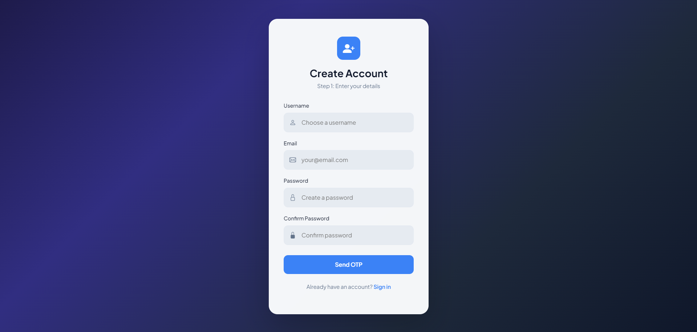
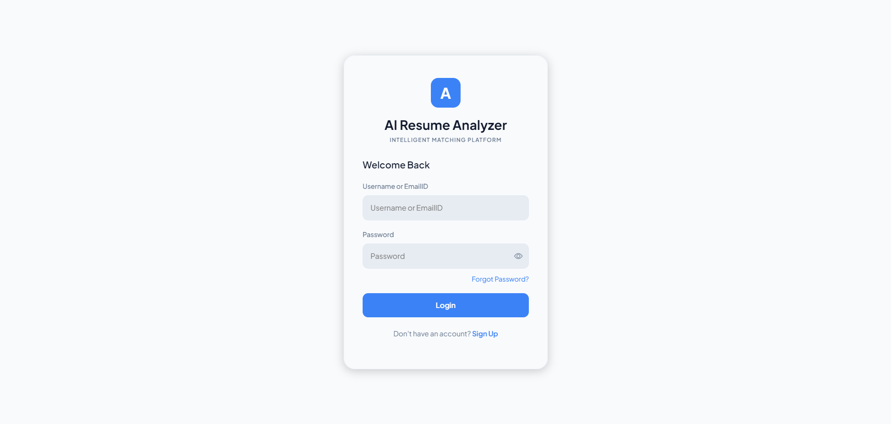
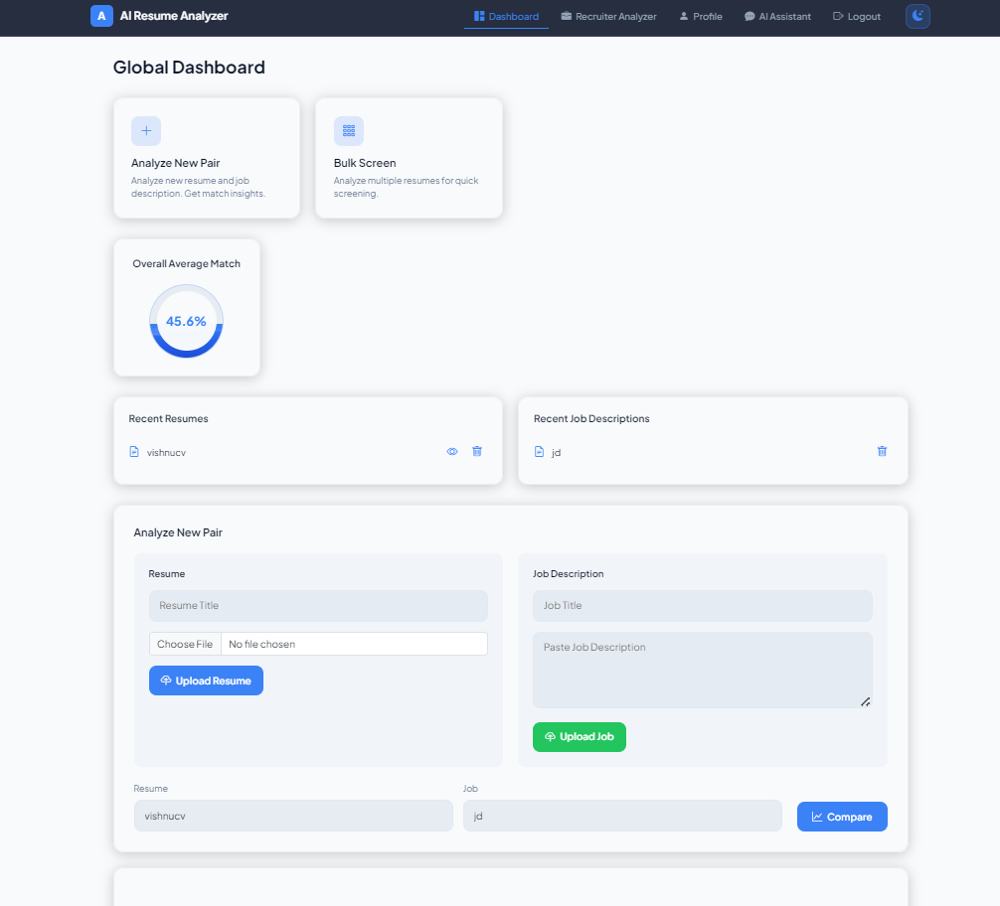
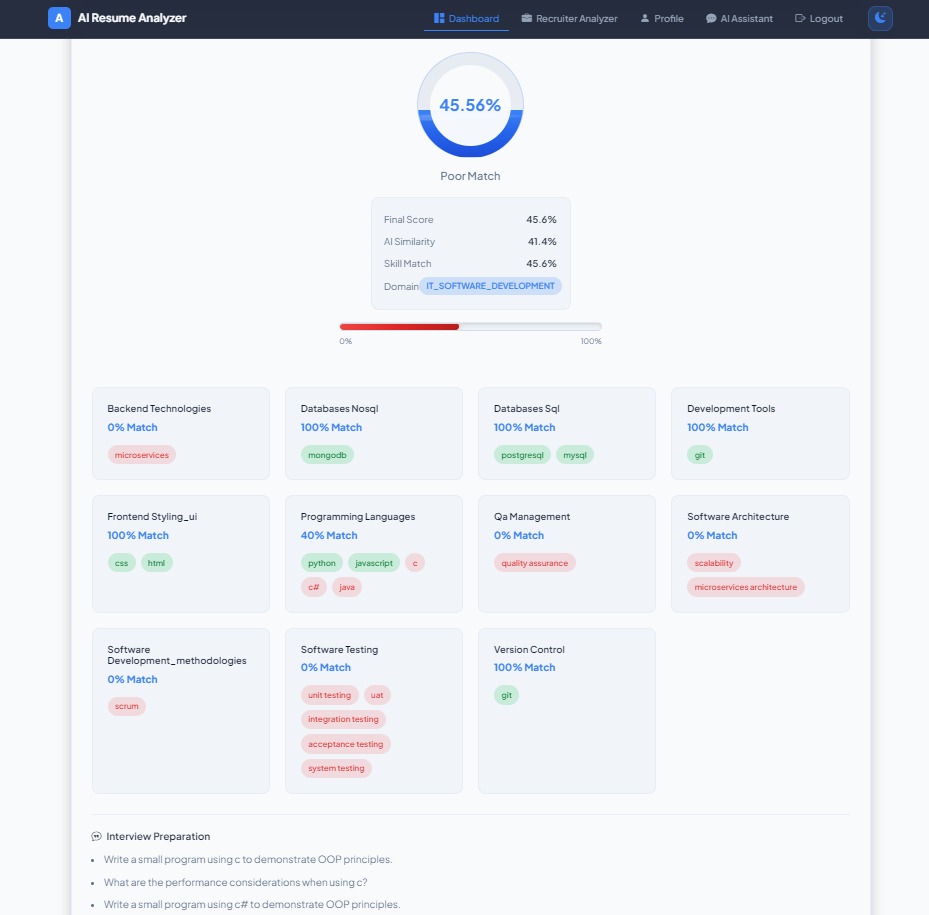
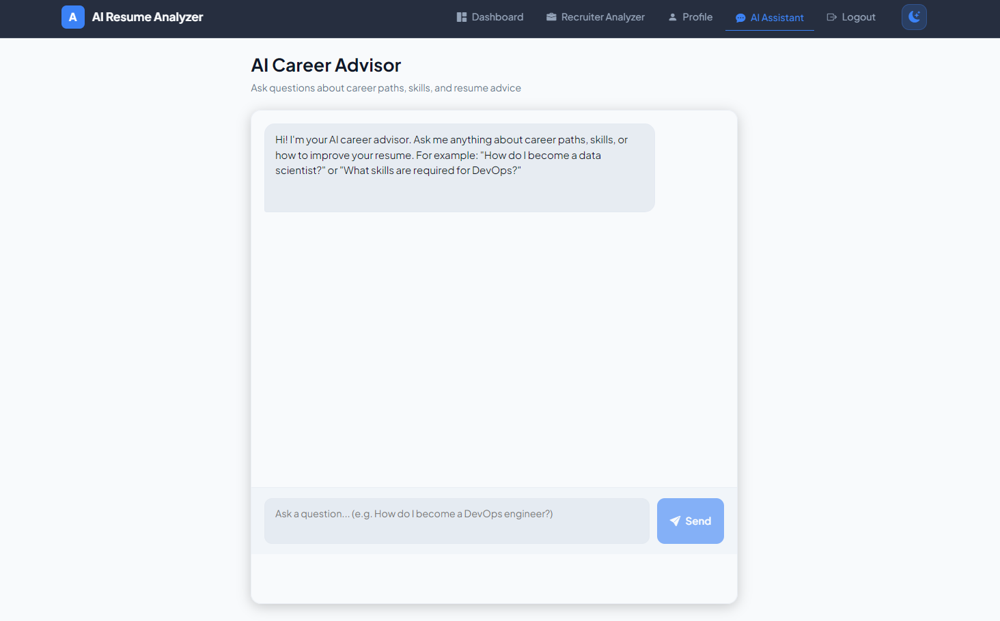
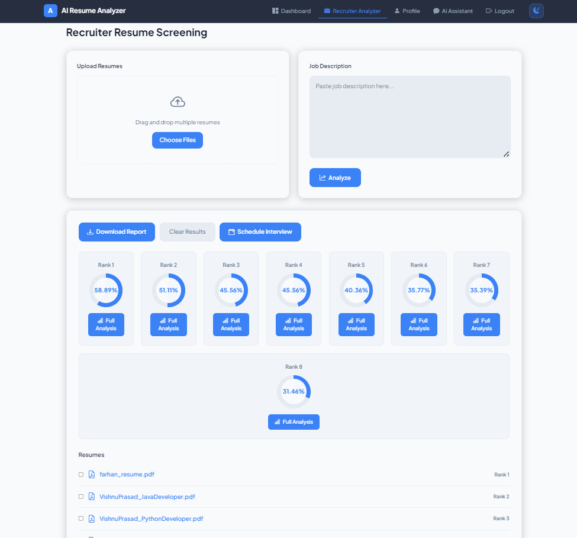
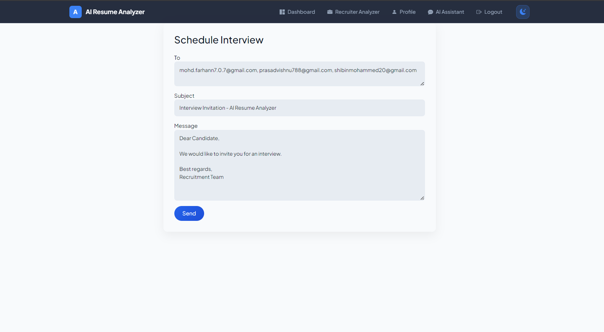
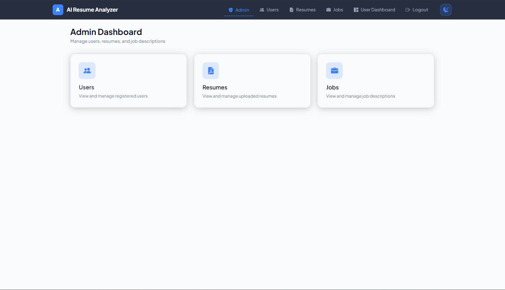
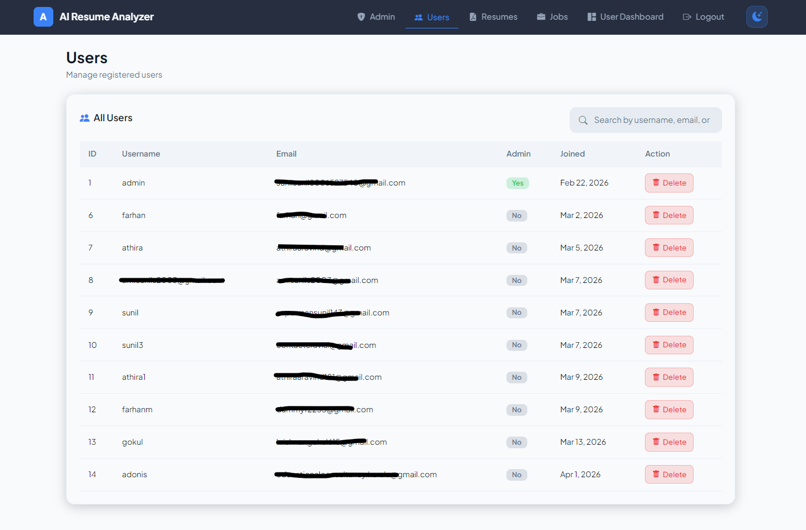
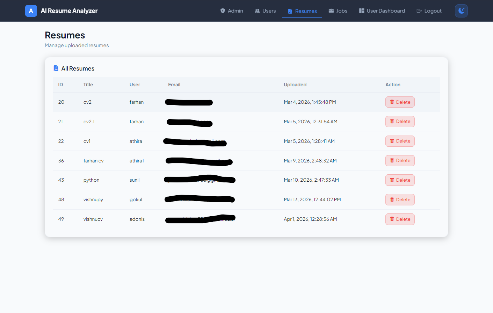

# AI Resume Analyzer 

A full-stack web application that analyzes resumes, matches them with job descriptions, and provides AI-powered career guidance.

---

##  Overview

This system automates the recruitment process by:
- Extracting skills from resumes and job descriptions
- Comparing them using rule-based + AI semantic matching
- Providing an overall match score with detailed insights
- Assisting users with career advice using AI

---

## Features

-  Resume upload (PDF) and text extraction  
-  Skill extraction and classification (spaCy)  
-  Resume vs Job matching with score breakdown  
-  Semantic similarity using AI (SentenceTransformers)  
-  AI Career Advisor (chat-based)  
-  Recruiter bulk analysis  
-  Admin dashboard (manage users, resumes, jobs)  
-  JWT Authentication  

---

## Screenshots




### Dashboard





### AI Assistant


### Recruiter Panel




### Admin Panel





---

## 🛠️ Tech Stack

### Frontend
- Angular
- TypeScript
- HTML, CSS

### Backend
- Django
- Django REST Framework
- JWT (SimpleJWT)

### AI / NLP
- spaCy (skill extraction)
- SentenceTransformers (semantic similarity)
- OpenAI / Gemini (AI assistant)

### Database
- SQLite (default)

---

## ⚙️ Setup Instructions

### 🔹 1. Clone Repository

```bash
git clone https://github.com/YOUR_USERNAME/AI-RESUME-ANALYZER.git
cd AI-RESUME-ANALYZER

--------------------------------------------------------------------------------

🔹 2. Backend Setup (Django)

Bash
cd backend

# Create virtual environment
python -m venv env

# Activate
env\Scripts\activate   # Windows

# Install dependencies
pip install -r requirements.txt

# Migrate database
python manage.py migrate

# Run server
python manage.py runserver


-------------------------------------------------------------------------------------

🔹 3. Frontend Setup (Angular)

Open new terminal:
Bash
cd frontend

npm install

ng serve


🔹 4. Open App

http://localhost:4200


Environment Variables

Create .env file in backend:

OPENAI_API_KEY=your_key_here
GEMINI_API_KEY=your_key_here


How It Works

Resume & Job Description are processed
Skills are extracted using NLP
Skills are classified into categories
Matching is done using:
Rule-based scoring
Semantic similarity (AI)
Final score + missing skills are generated


Output

Match percentage
Matched skills
Missing skills
Recommendations
AI-based insights


Future Improvements

Better NLP using NER models
Real-time deployment
Advanced recruiter analytics
Feedback-based learning system


References'
Django Documentation
Angular Documentation
spaCy
SentenceTransformers
scikit-learn

Author
Sunil S

